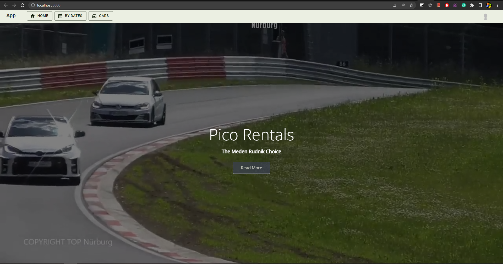
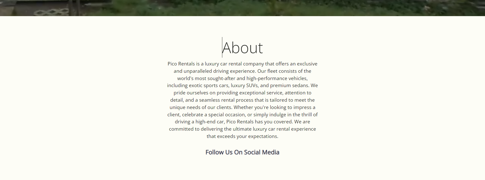
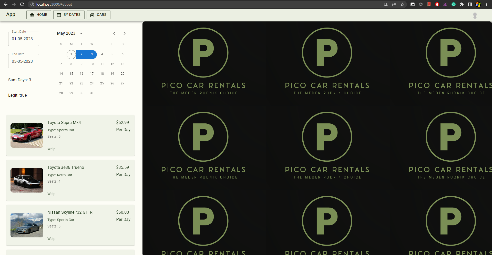
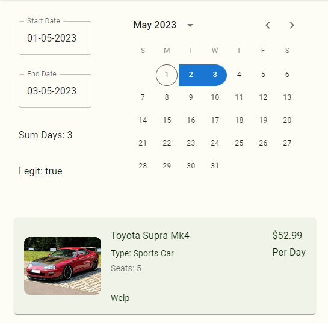
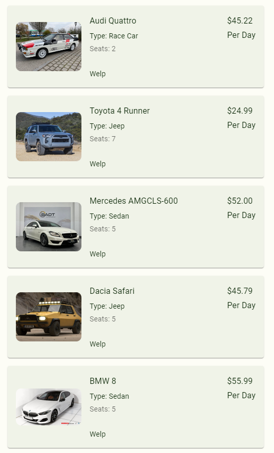
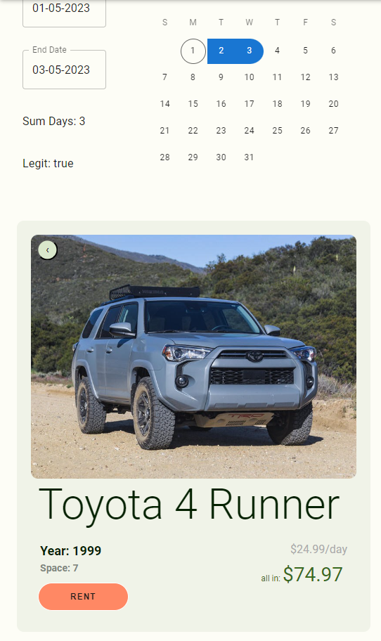
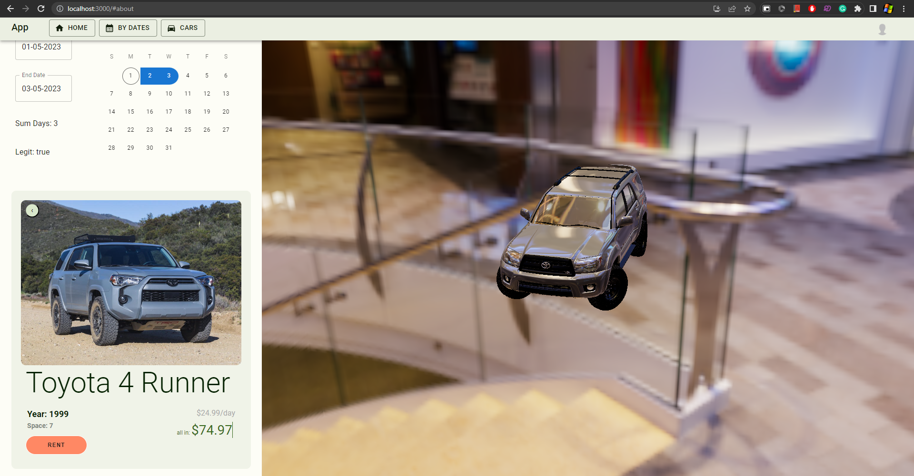
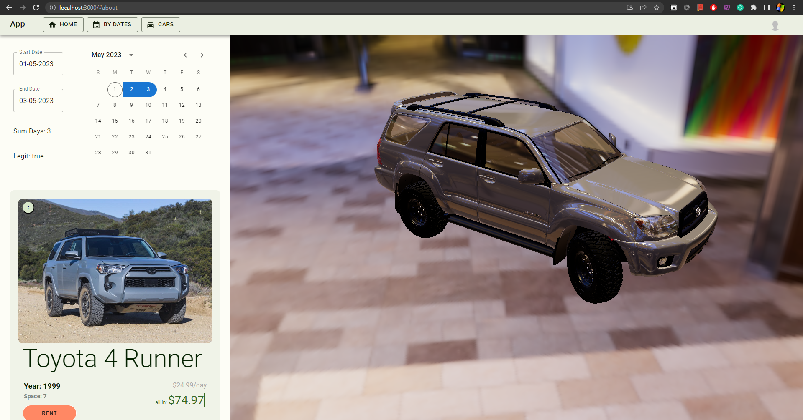
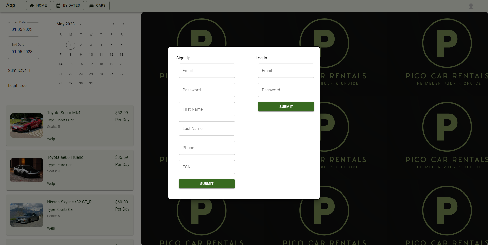

# Pico Car Rentals
<h3>Dependecies</h3>
Проект за ИТ Кариера с задача да бъде платформа за наем на автомобили 
Отворете Visual Studio и стартирайте API/CarRentalApi.sln: 
Отделно отворете папката frontend в предпочитано IDE след като е изтеглено Node.js 
<pre>npm install</pre>
<pre>npm start</pre>
 

<h2>Тур на сайта</h2>
Сайта се отваря с начална страница с видео за фон и about част.  

    
    

 
Функционалната част на проекта представлява меню за избиране на свободни автомобили в указан прериод за наем.  

    
    
    

 
След като е избран автомобил се отваря  компонент с повече информация за него и с възмоността да се запази./br> 

    

 
В главния компонент се показва 3D модел на избрания автомобил, което е главната отличаваща черта (има проблеми: трябва първо да се размърда черния екран за да се покаже модела; след като е показан модел не може да се смени без да се рестартира уеб страницата).  

    
    

 
Функциониращ формуляр за регистриране и влизане в профил, който е нужен за запазване на автомобил./br> 

    

 
